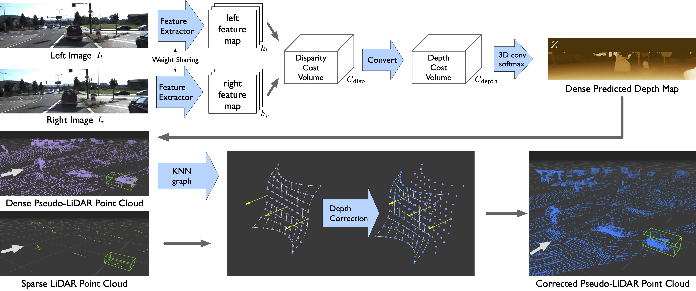

# Pseudo-LiDAR++: Accurate Depth for 3D Object Detection in Autonomous Driving
This paper has been accpeted by International Conference on Learning Representations ([ICLR](https://iclr.cc/)) 2020.

[Pseudo-LiDAR++: Accurate Depth for 3D Object Detection in Autonomous Driving](https://openreview.net/forum?id=BJedHRVtPB)

by [Yurong You*](http://yurongyou.com/), [Yan Wang*](https://www.cs.cornell.edu/~yanwang/) [Wei-Lun Chao*](http://www-scf.usc.edu/~weilunc/), [Divyansh Garg](http://divyanshgarg.com/), [Bharath Hariharan](http://home.bharathh.info/), [Mark Campbell](https://campbell.mae.cornell.edu/) and [Kilian Q. Weinberger](http://kilian.cs.cornell.edu/)


### Citation
```
@inproceedings{you2020pseudo,
  title={Pseudo-LiDAR++: Accurate Depth for 3D Object Detection in Autonomous Driving},
  author={You, Yurong and Wang, Yan and Chao, Wei-Lun and Garg, Divyansh and Pleiss, Geoff and Hariharan, Bharath and Campbell, Mark and Weinberger, Kilian Q},
  booktitle={ICLR},
  year={2020}
}
```

### Abstract
Detecting objects such as cars and pedestrians in 3D plays an indispensable role in autonomous driving. Existing approaches largely rely on expensive LiDAR sensors for accurate depth information. While recently pseudo-LiDAR has been introduced as a promising alternative, at a much lower cost based solely on stereo images, there is still a notable performance gap. In this paper we provide substantial advances to the pseudo-LiDAR framework through improvements in stereo depth estimation. Concretely, we adapt the stereo network architecture and loss function to be more aligned with accurate depth estimation of faraway objects --- currently the primary weakness of pseudo-LiDAR. Further, we explore the idea to leverage cheaper but extremely sparse LiDAR sensors, which alone provide insufficient information for 3D detection, to de-bias our depth estimation. We propose a depth-propagation algorithm, guided by the initial depth estimates, to diffuse these few exact measurements across the entire depth map. We show on the KITTI object detection benchmark that our combined approach yields substantial improvements in depth estimation and stereo-based 3D object detection --- outperforming the previous state-of-the-art detection accuracy for faraway objects by 40%.

## Contents

- [Requirments](#requirements)
- [Pretrained Models](#pretrained-models)
- [Training and Inference](#training-and-inference)


## Requirements
1. Python 3.7
2. Pytorch 1.0.0
3. CUDA
4. `pip install -r ./requirements.txt`
5. [SceneFlow](https://lmb.informatik.uni-freiburg.de/resources/datasets/SceneFlowDatasets.en.html)
5. [KITTI](http://www.cvlibs.net/datasets/kitti/eval_object.php?obj_benchmark=3d)

## Pretrained Models
* Trained on SceneFlow [sdn_sceneflow.pth](https://drive.google.com/file/d/1KtENGGDA8raKe5rl-eaLDAKgMneZk-KC/view?usp=sharing).
* Trained on KITTI Object Detection training set [sdn_kitti_object.pth](https://drive.google.com/file/d/1texWU57M7gCih5EBWX99nLeM33F1Y8y3/view?usp=sharing).
* Trained on KITTI Object Detection training+validation sets [sdn_kitti_object_trainval.pth](https://drive.google.com/file/d/10Kbc-lOC6L0hGxFQoGL3BAl6jRPAyN3x/view?usp=sharing).

## Datasets
You have to download the [SceneFlow](https://lmb.informatik.uni-freiburg.de/resources/datasets/SceneFlowDatasets.en.html) and [KITTI](http://www.cvlibs.net/datasets/kitti/eval_object.php?obj_benchmark=3d) datasets. The structures of the datasets are shown in below. 
#### SceneFlow Dataset Structure
```
SceneFlow
    | monkaa
        | frames_cleanpass
        | disparity
    | driving
        | frames_cleanpass
        | disparity
    | flyingthings3d
        | frames_cleanpass 
        | disparity
```
#### KITTI Object Detection Dataset Structure
```
KITTI
    | training
        | calib
        | image_2
        | image_3
        | velodyne
    | testing
        | calib
        | image_2
        | image_3
```
Generate soft-links of SceneFlow Datasets. The results will be saved in `./sceneflow` folder. Please change to fakepath `path-to-SceneFlow` to the SceneFlow dataset location before running the script.
```bash
python scneflow.py --path path-to-SceneFlow --force
```
Convert the KITTI velodyne ground truths to depth maps. Please change to fakepath `path-to-KITTI` to the SceneFlow dataset location before running the script.
```bash
python ./src/preprocess/generate_depth_map.py --data_path path-to-KITTI/ --split_file ./split/trainval.txt
```
## Training and Inference
- [1 Train SDNet from Scratch on SceneFlow Dataset](#1-train-sDNet-from-scratch-on-sceneflow-dataset)
- [2 Train SDNet on KITTI Dataset](#2-train-sdnet-on-kitti-dataset)
- [3 Generate Predictions](#3-generate-predictions)
- [4 Convert predictions to Pseudo-LiDAR and Planes](#4-convert-predictions-to-pseudo-lidar-and-planes)
- [5 Sparsify Pseudo-LiDAR](#5-sparsify-pseudo-lidar)
- [6 Graph-based Depth Correction](#6-graph-based-depth-correction)
- [7 Train 3D Detection with Pseudo-LiDAR](#7-train-3d-detection-with-pseudo-lidar)

We have provided all pretrained models [Pretrained Models](#pretrained-models). If you only want to generate the predictions, you can directly go to step [3](#3-generate-predictions). 

The default setting requires four gpus to train. You can use smaller batch sizes which are `btrain` and `bval`, if you don't have enough gpus. 
#### 1 Train SDNet from Scratch on SceneFlow Dataset
```bash
python ./src/main.py -c src/configs/sdn_sceneflow.config
```
The checkpoints are saved in `./results/sdn_sceneflow/`.
#### 2 Train SDNet on KITTI Dataset
```bash
python ./src/main.py -c src/configs/sdn_kitti_train.config \
    --pretrain ./results/sdn_sceneflow/checkpoint.pth.tar --dataset  path-to-KITTI/training/
```
Before running, please change the fakepath `path-to-KITTI/` to the correct one. `--pretrain` is the path to the  pretrained model on SceneFlow. The training results are saved in `./results/sdn_kitti_train_set`.

If you are working on evaluating SDNet on KITTI testing set, you might want to train SDNet on *training+validation* sets. The training results will be saved in `./results/sdn_kitti_trainval_set`.
```bash
python ./src/main.py -c src/configs/sdn_kitti_train.config \
    --pretrain ./results/sdn_sceneflow/checkpoint.pth.tar \
    --dataset  path-to-KITTI/training/ --split_train ./split/trainval.txt \
    --save_path ./results/sdn_kitti_trainval_set
``` 
#### 3 Generate Predictions
Please change the fakepath `path-to-KITTI`. Moreover, if you use the our provided checkpoint, please modify the value of `--resume` to the checkpoint location. 

* a. Using the model trained on KITTI training set, and generating predictions on training + validation sets.
```bash
python ./src/main.py -c src/configs/sdn_kitti_train.config \
    --resume ./results/sdn_kitti_train_set/checkpoint.pth.tar --datapath  path-to-KITTI/training/ \
    --data_list ./split/trainval.txt --generate_depth_map --data_tag trainval
``` 
The results will be saved in `./results/sdn_kitti_train_set/depth_maps_trainval/`.

* b. Using the model trained on KITTI training + validation set, and generating predictions on training + validation and testing sets. You will use them when you want to submit your results to the leaderboard.
```bash
# training + validation sets
python ./src/main.py -c src/configs/sdn_kitti_train.config \
    --resume ./results/sdn_kitti_trainval_set/checkpoint.pth.tar --datapath  path-to-KITTI/training/ \
    --data_list=./split/trainval.txt --generate_depth_map --data_tag trainval
``` 
The results will be saved in `./results/sdn_kitti_trainval_set/depth_maps_trainval/`.
```bash
# testing sets
python ./src/main.py -c src/configs/sdn_kitti_train.config \
    --resume ./results/sdn_kitti_trainval_set/checkpoint.pth.tar --datapath  path-to-KITTI/testing/ \
    --data_list=./split/test.txt --generate_depth_map --data_tag test
``` 
The results will be saved in `./results/sdn_kitti_trainval_set/depth_maps_test/`.
#### 4 Convert predictions to Pseudo-LiDAR and Planes
Here, I provide an example. You have to change the paths accordingly. In this example, it will load calibrations from `calib_dir`, and load depth maps from `depth_dir`. The results will be saved in `save_dir`.
```bash
# Convert depth maps to Pseudo-Lidar Point Clouds
python ./src/preprocess/generate_lidar_from_depth.py --calib_dir  path-to-KITTI/training/calib \
    --depth_dir ./results/sdn_kitti_train_set/depth_maps/trainval/  \
    --save_dir  ./results/sdn_kitti_train_set/pseudo_lidar_trainval/
``` 
```bash
# Predict Ground Planes
python ./src/preprocess/kitti_process_RANSAC.py --calib_dir  path-to-KITTI/training/calib \
    --lidar_dir ./results/ssdn_kitti_train_set/pseudo_lidar_trainval/  \
    --planes_dir  ./results/sdn_kitti_train_set/pseudo_lidar_trainval_planes/
``` 
#### 5 Sparsify Pseudo-LiDAR
Some 3D Object Detection models, such as PointRCNN, requires sparse point clouds. We provide an script to downsample the dense Pseudo-LiDAR clouds.
```bash
# Sparsify Pseudo-LiDAR
python ./src/preprocess/kitti_sparsify.py --pl_path  ./results/ssdn_kitti_train_set/pseudo_lidar_trainval/  \
    --sparse_pl_path  ./results/sdn_kitti_train_set/pseudo_lidar_trainval_sparse/
``` 
#### 6 Graph-based Depth Correction 
Please check the code and [README.md](gdc/README.md) in [./gdc](gdc) for more details.
#### 7 Train 3D Detection with Pseudo-LiDAR
Please check the Pseudo-LiDAR repo for more details https://github.com/mileyan/pseudo_lidar.

## Results
We have uploaded the Pseudo-LiDAR clouds trained on only KITTI training set (not validation data). You can download them from google drive.
- [sdn_kitti_train_set](https://drive.google.com/drive/folders/1_G7f8GdzMGkVw95_pAsXZJnYbWtekAPh?usp=sharing): Point Clouds of the SDNet model trained on KITTI training set 
- [sdn_kitti_train_set_sparse](https://drive.google.com/file/d/1qloBZszzKcuILJc5DxwR2ylFNdilCDbm/view?usp=sharing): Sparse Point Clouds of the SDNet model trained on KITTI training set 
- [sdn_kitti_train_set_planes](https://drive.google.com/file/d/1gd-p2o7UwDmVEy2o0QDJjs4ZdaoyXSQ1/view?usp=sharing): Planes of the SDNet model trained on KITTI training set 
- [sdn_kitti_train_val_set](https://drive.google.com/drive/folders/1AJ3bVc8k-5zMYWw2ZEj631-SczIa808T?usp=sharing): Point Clouds of the SDNet model trained on KITTI training+validation sets
- [sdn_kitti_train_val_set_sparse](https://drive.google.com/file/d/1B2gP0GGTOARdiA8xoriXa1g9Fy0FTiXY/view?usp=sharing): Sparse Point Clouds of the SDNet model trained on KITTI training+validation sets
- [sdn_kitti_train_val_set_planes](https://drive.google.com/file/d/1baNwJkZbVS8w15aOmX3Fx20OuUJBEtB5/view?usp=sharing): Planes of the SDNet model trained on KITTI training+validation sets

## Questions
Please feel free email us if you have any questions. 

Yan Wang [yw763@cornell.edu](mailto:yw763@cornell.edu?subject=[GitHub]%20Pseudo-Lidar_Plus_Plus)
Yurong You [yy785@cornell.edu](mailto:yy785@cornell.edu?subject=[GitHub]%20Pseudo-Lidar_Plus_Plus)
Wei-Lun Chao [weilunchao760414@gmail.com](mailto:weilunchao760414@gmail.com?subject=[GitHub]%20Pseudo-Lidar_Plus_Plus)
